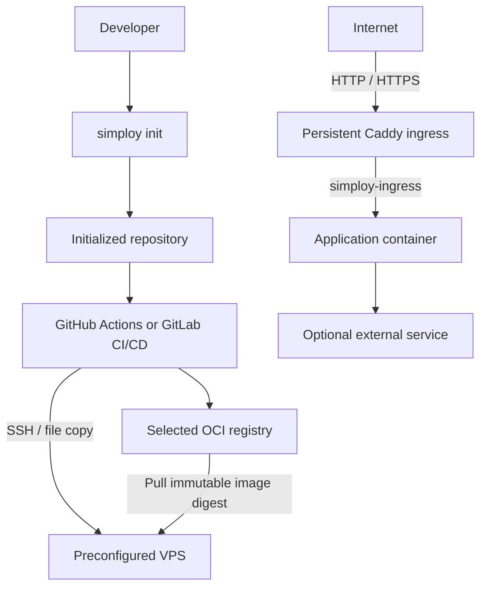

# Simploy v0 Architecture

## Status

This document is the architecture baseline for the clean Simploy v0 implementation.

Simploy v0 is a lightweight project initializer for one containerized web application deployed to one preconfigured VPS.

Simploy creates the application structure, deployment assets, selected CI workflow, and optional external-service integrations. After initialization, Simploy is not part of the deployment path. GitHub Actions or GitLab CI/CD performs deployment over SSH using the generated files.

The VPS does not run a Simploy daemon, deployment engine, SSH gateway, API, webhook receiver, or self-hosted CI runner.

---

## Goals

Simploy v0 must:

- initialize a complete deployable project;
- support one containerized web application per repository;
- remain framework-, database-, authentication-, and storage-agnostic at its core;
- support GitHub Actions or GitLab CI/CD, with exactly one provider selected per project;
- use the selected provider's container registry;
- target one preconfigured VPS;
- use Docker Compose as the single-host execution layer;
- use Caddy as the sole public web ingress;
- keep application and service ports private unless explicitly required;
- support optional external-service integrations without coupling them to the core deployment contract;
- provide Next.js as the v0 reference application integration;
- provide Supabase as the v0 reference external-service integration;
- remain understandable and operable without Kubernetes or a permanent Simploy service.

---

## Non-goals

The following are explicitly outside v0:

- Simploy daemon or agent on the VPS;
- server-side Simploy deployment engine;
- SSH gateway or forced-command gateway;
- public deployment API;
- webhook receiver;
- self-hosted CI runner on the production VPS;
- Kubernetes, Swarm, Nomad, or another orchestrator;
- multi-VPS scheduling;
- high availability;
- automatic VPS provisioning;
- automatic Docker installation;
- automatic OpenSSH installation;
- operating-system hardening;
- multi-application repository support;
- hosted Simploy control plane;
- arbitrary framework detection;
- mandatory external secret manager;
- automatic Supabase deployment or lifecycle management;
- adoption of arbitrary existing repositories in the initial v0 scope.

---

## System Context



Simploy participates only in initialization.

The deployment path after initialization is:

```text
repository
    ↓
hosted CI
    ↓
OCI registry + SSH
    ↓
preconfigured VPS
```

---

## Project Structure

The initialized project is separated into three primary areas:

```text
project/
├── .git/
├── app/
├── simploy/
├── services/
├── .github/
│   └── workflows/
│       └── ...
└── .gitlab-ci.yml
```

Only the selected CI provider is created.

### `app/`

Contains the application source.

For v0:

- `nextjs` creates a Next.js application using the official `create-next-app`;
- `none` creates an empty `app/` directory.

Framework-specific service integration helpers belong in `app/`.

### `simploy/`

Contains deployment assets:

```text
simploy/
├── deploy.env
├── compose.yml
└── Caddyfile
```

`deploy.env` is intentionally committed and contains only non-secret deployment configuration.

### `services/`

Contains external-service integration contracts.

Services are connections/integrations, not infrastructure Simploy deploys or operates.

### CI configuration

CI files remain in the provider-required locations:

- GitHub Actions: `.github/workflows/...`
- GitLab CI/CD: `.gitlab-ci.yml`

---

## CLI Boundary

v0 exposes one required project command:

```bash
pnpm simploy init
```

There is no Simploy deployment runtime and no required:

```text
simploy generate
simploy validate
simploy deploy
```

Deployment is performed by the generated CI workflow.

---

## Initialization Contract

`simploy init` creates the complete initial project.

It gathers:

1. project name;
2. application;
3. CI provider;
4. services;
5. domain;
6. application port.

Defaults:

```text
project name: simplapp
domain:       app.localhost
port:         3000
```

Supported application choices:

```text
nextjs
none
```

Supported CI choices:

```text
github
gitlab
```

Exactly one CI provider is mandatory.

Services are optional and may be multiple. The v0 reference service is Supabase.

CLI flags may pre-answer init prompts, including:

```bash
pnpm simploy init --name my-project --app nextjs --domain example.com --port 3000
```

For Next.js:

```bash
pnpm simploy init --app nextjs --app-default
```

uses the official `create-next-app` defaults without framework-specific prompts.

Simploy does not modify `/etc/hosts`.

Simploy creates one Git repository at the project root after generating the
complete project. The Next.js generator is invoked with `--disable-git` so it
does not create a nested repository in `app/`. Initializing into an existing
Git repository remains outside v0.

Initialization may run in a non-empty directory. If a Simploy-managed target already exists, Simploy asks whether to replace it. Declining aborts initialization.

---

## Deployment Configuration

There is no custom YAML deployment contract.

There is no `simploy.config.yml`.

Stable non-secret deployment configuration lives in:

```text
simploy/deploy.env
```

For the core v0 application contract it contains exactly:

```env
DOMAIN=app.localhost
APP_PORT=3000
```

Rules:

- `deploy.env` is committed intentionally;
- it contains only non-secret deployment values;
- secrets are forbidden from it;
- there is no duplicate `.env.example` for this deployment contract;
- `DOMAIN` and `APP_PORT` are not duplicated as manually maintained CI variables;
- Docker Compose consumes this deployment environment;
- Caddy receives the same deployment environment;
- the application image is not stored in this file.

The file is named `deploy.env`, not `.env`, to make its committed, non-secret purpose explicit and avoid normalizing committed secret-bearing `.env` files.

---

## Application Image Contract

The application image is release-specific.

The generated CI workflow is designed to:

1. build the production OCI image;
2. push it to the selected provider registry;
3. resolve the immutable digest;
4. deploy the exact image reference:

```text
repository/image@sha256:<digest>
```

Mutable tags such as `latest` are not sufficient as the release identity.

---

## CI/CD Boundary

GitHub Actions or GitLab CI/CD is the deployment orchestrator after initialization.

The generated workflow is intended to perform the deployment sequence, including:

- application checks;
- image build;
- registry push;
- immutable digest resolution;
- SSH connection to the VPS;
- use of the committed deployment assets;
- Docker Compose operations;
- Caddy configuration/update operations;
- optional application health checking;
- rollback logic where defined by the generated workflow.

These are properties of the generated CI workflow, not runtime responsibilities of Simploy itself.

Provider-level deployment serialization is used:

- GitHub Actions: production concurrency group;
- GitLab CI/CD: production `resource_group`.

CI does not install or run Simploy.

---

## SSH and CI Secret Contract

The generated CI configuration expects the operator to configure:

```text
VPS_HOST
VPS_USER
SSH_PRIVATE_KEY
SSH_KNOWN_HOSTS
```

v0 assumes SSH port `22`.

Simploy does not:

- ask for these values during init;
- store them;
- upload them to GitHub or GitLab;
- act as a secret manager.

`SSH_KNOWN_HOSTS` exists so CI can verify the VPS host key.

---

## Runtime Application Secrets

Application runtime secrets are separate from `simploy/deploy.env`.

Examples include database credentials, authentication secrets, and external-service keys.

The generated CI workflow is designed to consume protected CI secrets/variables and materialize restrictive runtime files on the VPS where required.

Runtime secrets must not be:

- committed to Git;
- written into `simploy/deploy.env`;
- baked into application images;
- printed into normal CI logs;
- exposed in browser bundles unless intentionally public configuration.

Simploy itself does not retain runtime secret values.

---

## Docker Compose

Docker Compose is the single-host application execution layer.

The application:

- joins the private production ingress network;
- exposes its HTTP port internally;
- does not publish the application port publicly on the VPS.

Production ingress network:

```text
simploy-ingress
```

Integration-test ingress network:

```text
simploy-integration-test-ingress
```

The application image is supplied by CI as the immutable release digest.

Compose consumes the stable values from `simploy/deploy.env`.

---

## Caddy

Caddy is persistent VPS infrastructure and is not part of the application's Docker Compose lifecycle.

It is the sole public web ingress:

```text
Internet
    ↓
VPS :80 / :443
    ↓
Caddy
    ↓
simploy-ingress
    ↓
application container
```

The generated deployment assets are designed so that:

- Caddy owns public ports 80 and 443;
- the application port remains private;
- Caddy receives the same `DOMAIN` value defined in `simploy/deploy.env`;
- application-supplied arbitrary Caddyfile fragments are not accepted;
- CI can validate and apply the generated application-specific Caddy configuration;
- Caddy remains independent of the application's Compose lifecycle.

---

## Optional Health Check

Health checking is a generated CI workflow capability.

It is optional.

When configured, the CI workflow checks the application health endpoint after deployment and applies its configured deployment/rollback behavior.

Simploy does not perform health checks itself.

---

## Service Boundary

The term is:

```text
service
```

not `plugin`.

A Simploy service integration represents an external capability the application connects to.

It may provide:

- required environment-variable documentation;
- repository-side integration files;
- framework-specific client/server helpers inside `app/`;
- service-specific setup documentation;
- application-side configuration needed to connect to the service.

It does not imply that Simploy deploys or operates the service.

---

## Supabase Reference Integration

Supabase is the v0 reference service integration.

Simploy does not:

- install Supabase;
- copy the Supabase self-hosted Docker stack to the VPS;
- deploy Supabase;
- upgrade Supabase;
- back up Supabase;
- manage Supabase lifecycle.

The user is responsible for deploying and operating Supabase.

Selecting Supabase during init prepares the project to connect to an existing Supabase deployment.

Service-side integration material lives under:

```text
services/supabase/
```

Framework-specific application integration belongs under:

```text
app/
```

For a Next.js application, Simploy adds the appropriate Supabase integration helpers to the application.

Real Supabase credentials follow the runtime-secret contract and are not committed.

---

## Security Boundary

Simploy's security responsibility is limited to the project and configuration it generates.

It does not secure or harden the VPS at runtime.

The generated deployment configuration should follow these properties:

- dedicated deployment SSH credentials;
- private deployment key stored only in protected CI secrets;
- VPS host-key verification through `SSH_KNOWN_HOSTS`;
- no disabling of SSH host verification;
- no secrets in committed deployment configuration;
- no secrets baked into application images;
- no privileged application containers generated by default;
- no Docker socket mounted into application containers;
- generated production CI intended for trusted/protected refs;
- CI and deployment configuration treated as production-sensitive code.

The protected CI workflow is part of the production trust boundary because it can connect to the VPS and control Docker.

Docker access should be treated as effectively privileged VPS access.

VPS provisioning and hardening remain operator responsibilities.

---

## Responsibility Matrix

| Concern | Owner |
| --- | --- |
| Project initialization | Simploy |
| Application source | Application repository |
| Application framework | Selected application integration / user |
| CI workflow generation | Simploy |
| OCI image build | CI |
| Image identity and registry push | CI + selected provider registry |
| Stable deployment values | `simploy/deploy.env` |
| Deployment execution | CI |
| SSH credentials | Operator + CI secret store |
| File transfer during deployment | CI |
| Docker Compose execution | CI invoking Docker Compose on VPS |
| Public HTTPS/routing | Caddy |
| Runtime application behavior | Application image |
| External DB/auth/storage service | User-selected external service |
| Supabase deployment/operation | User |
| Supabase application integration | Simploy service integration + application |
| Runtime application secrets | CI secret store + VPS runtime files |
| VPS provisioning/hardening | Operator |
| Backup policy/off-host storage | Operator / external service owner |

---

## Tooling

Simploy v0 implementation tooling:

- Node.js;
- TypeScript;
- pnpm;
- Biome for formatting and linting;
- TypeScript `tsc --noEmit` for static type checking;
- Vitest for tests;
- Node standard file-system APIs;
- Node child-process APIs where approved external commands are required;
- templates bundled with the Simploy package.

A CLI parser and interactive prompt library may be used to implement the defined init behavior.

The former YAML/Zod deployment-config stack is no longer required for `simploy.config.yml`, because that file no longer exists.

Dependencies should only be added when required by implemented behavior.

---

## Canonical Workflow

```text
pnpm simploy init
        ↓
complete project created
        ↓
developer reviews application + deployment files
        ↓
developer configures required CI secrets
        ↓
commit / push
        ↓
generated CI workflow performs deployment
```

Simploy is not involved after initialization.
