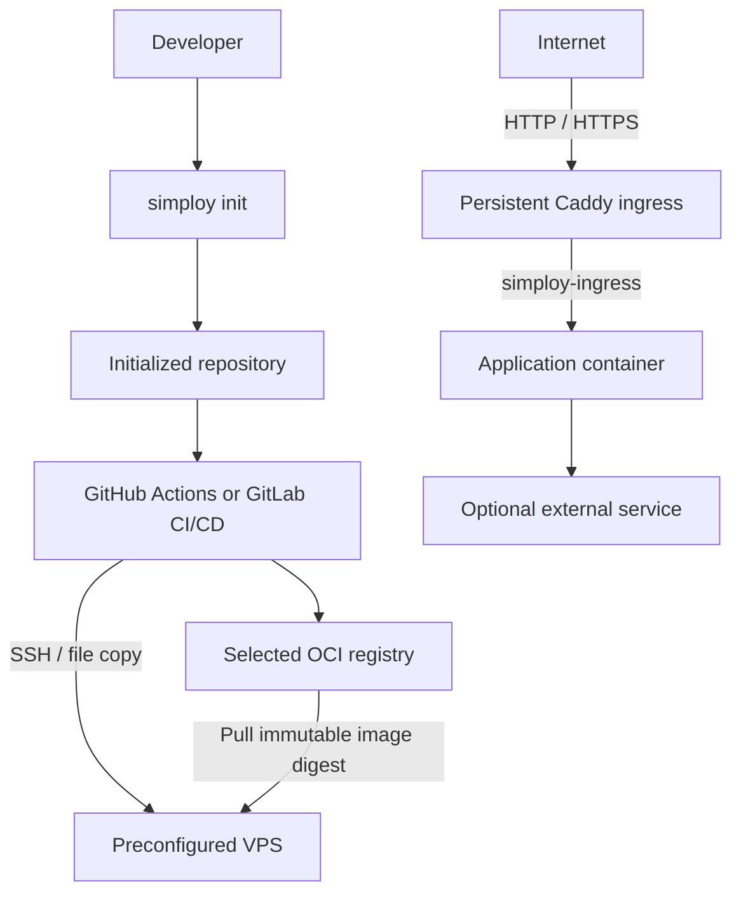

# Simploy v0 — Consolidated Architecture and Specification

## Status

This document is the current consolidated specification for the clean Simploy v0 implementation.

Simploy v0 is a lightweight project initializer for one containerized web application deployed to one preconfigured VPS.

Simploy creates the application, deployment assets, selected CI workflow, and optional external-service integrations. After initialization, Simploy is not part of deployment execution. GitHub Actions or GitLab CI/CD performs deployment over SSH using the generated files.

---

## 1. Goals

Simploy v0 must:

- initialize a complete deployable project;
- support one containerized web application per repository;
- remain framework-, database-, authentication-, and storage-agnostic at its core;
- support GitHub Actions or GitLab CI/CD, with exactly one provider selected per project;
- use the selected provider's container registry;
- target one preconfigured VPS;
- use Docker Compose as the single-host execution layer;
- use Caddy as the sole public web ingress;
- keep application and service ports private unless explicitly required;
- support optional external-service integrations without coupling them to the core deployment contract;
- provide Next.js as the v0 reference application integration;
- provide Supabase as the v0 reference external-service integration;
- remain understandable and operable without Kubernetes, a permanent Simploy service, or a custom deployment engine.

---

## 2. Non-goals

The following are explicitly outside v0:

- Simploy daemon or agent on the VPS;
- server-side Simploy deployment engine;
- SSH gateway or forced-command gateway;
- public deployment API;
- webhook receiver;
- self-hosted CI runner on the production VPS;
- Kubernetes, Swarm, Nomad, or another orchestrator;
- multi-VPS scheduling;
- high availability;
- automatic VPS provisioning;
- automatic Docker installation;
- automatic OpenSSH installation;
- operating-system hardening;
- multi-application repository support;
- hosted Simploy control plane;
- arbitrary framework detection;
- mandatory external secret manager;
- automatic Supabase deployment or lifecycle management;
- adoption of arbitrary existing repositories in the initial v0 scope.

---

## 3. System Architecture



The VPS does **not** run Simploy.

After initialization the deployment path is:

```text
repository
    ↓
hosted CI
    ↓
OCI registry + SSH
    ↓
preconfigured VPS
```

---

## 4. Project Structure

The initialized project is separated into three primary areas:

```text
project/
├── .git/
├── app/
├── simploy/
├── services/
├── .github/
│   └── workflows/
│       └── ...
└── .gitlab-ci.yml
```

Only the selected CI provider is created.

### `app/`

Contains the application source code.

For v0:

- `nextjs` creates a Next.js application using the official `create-next-app`;
- `none` creates an empty `app/` directory.

Framework-specific service helpers belong in `app/`.

### `simploy/`

Contains deployment assets:

```text
simploy/
├── deploy.env
├── compose.yml
└── Caddyfile
```

### `services/`

Contains optional external-service integration contracts.

Services are connections/integrations, not infrastructure that Simploy owns or deploys.

For Supabase, the user is responsible for deploying and operating Supabase.

### CI configuration

CI files remain in the locations required by the provider:

- GitHub Actions: `.github/workflows/...`
- GitLab CI/CD: `.gitlab-ci.yml`

---

## 5. CLI

v0 exposes one required Simploy project command:

```bash
pnpm simploy init
```

There is no required:

```text
simploy generate
simploy validate
simploy deploy
```

Deployment is performed by the generated CI workflow.

---

## 6. `simploy init`

`simploy init` creates the complete initial project.

### 6.1 Structural choices

Initialization gathers:

1. project name;
2. application;
3. CI provider;
4. services;
5. domain;
6. application port.

All Simploy choices are gathered before Simploy writes project files.

### 6.2 Project name

Default:

```text
simplapp
```

CLI form:

```bash
pnpm simploy init --name my-project
```

### 6.3 Application

Supported v0 choices:

```text
nextjs
none
```

Examples:

```bash
pnpm simploy init --app nextjs
```

```bash
pnpm simploy init --app none
```

When `nextjs` is selected:

- Simploy invokes the official `create-next-app`;
- normal `create-next-app` prompts remain available;
- Simploy does not duplicate or rename all framework-specific options.

Shortcut:

```bash
pnpm simploy init --app nextjs --app-default
```

`--app-default` uses the framework defaults without asking framework-specific questions.

When `none` is selected, `app/` is created empty.

After all selected project files are prepared, Simploy initializes one Git
repository at the project root. The Next.js generator receives `--disable-git`
so it does not initialize `app/` as a nested repository. Initializing into an
existing Git repository remains outside v0.

### 6.4 CI provider

Exactly one CI provider is mandatory:

```text
github
gitlab
```

`none` is invalid.

The selected provider's CI file is created during initialization.

### 6.5 Services

Services are optional and may be multiple.

`none` is valid.

The v0 reference service is:

```text
supabase
```

CLI example:

```bash
pnpm simploy init --services supabase
```

The CLI may support multiple selected services through the same option.

### 6.6 Domain

Default:

```text
app.localhost
```

CLI form:

```bash
pnpm simploy init --domain example.com
```

Simploy does not modify `/etc/hosts`.

### 6.7 Application port

Default:

```text
3000
```

CLI form:

```bash
pnpm simploy init --port 3000
```

### 6.8 Non-interactive initialization

Supplied CLI options pre-answer their corresponding prompts.

If every required Simploy choice is supplied, no final Simploy confirmation is required.

Framework-specific prompts remain controlled by the selected framework unless `--app-default` is used.

### 6.9 Existing files

Initialization may run in a non-empty directory.

If a Simploy-managed target that init intends to create already exists:

- Simploy asks whether to replace it;
- declining aborts initialization;
- a declined/cancelled pre-write initialization must not leave a partial Simploy project.

---

## 7. Deployment Configuration

There is no custom YAML deployment contract.

The previous `simploy.config.yml` design is removed.

Stable non-secret deployment configuration lives in:

```text
simploy/deploy.env
```

For the core v0 application contract it contains exactly:

```env
DOMAIN=app.localhost
APP_PORT=3000
```

Rules:

- `deploy.env` is intentionally committed;
- it contains only non-secret deployment values;
- secrets are forbidden from it;
- there is no separate `.env.example` for this deployment contract;
- `DOMAIN` and `APP_PORT` are not duplicated as manually maintained CI variables;
- Docker Compose consumes the same deployment environment;
- Caddy receives the same deployment environment;
- the application image identity is not stored here.

The explicit name `deploy.env` distinguishes this committed deployment configuration from conventional local `.env` files that may contain secrets.

---

## 8. Application Image Contract

The application image is release-specific.

The generated CI workflow is designed to:

1. build the production OCI image;
2. push it to the selected provider registry;
3. resolve the immutable digest;
4. deploy the exact image reference:

```text
repository/image@sha256:<digest>
```

Mutable tags such as `latest` are not sufficient as the release identity.

The image reference is not stored in `simploy/deploy.env`.

---

## 9. Generated CI/CD Contract

The selected CI provider becomes the deployment orchestrator after initialization.

The generated workflow is designed to perform:

1. checkout of the exact commit;
2. required application checks;
3. production image build;
4. image push to the selected registry;
5. immutable digest resolution;
6. SSH connection to the VPS;
7. use/transfer of the committed deployment assets required by the workflow;
8. Docker Compose deployment operations;
9. Caddy configuration/update operations;
10. optional application health checking;
11. rollback behavior where defined by the generated workflow;
12. provider-visible job success or failure.

These are properties of the generated CI workflow, not runtime responsibilities of Simploy.

Provider-level deployment serialization is authoritative in v0:

- GitHub Actions: production concurrency group;
- GitLab CI/CD: production `resource_group`.

CI does not install or run Simploy.

---

## 10. CI SSH Variables and Secrets

The generated CI configuration expects the operator to configure:

```text
VPS_HOST
VPS_USER
SSH_PRIVATE_KEY
SSH_KNOWN_HOSTS
```

Generated CI defaults to SSH port `22`; operators may override it with `VPS_PORT`.

Generated CI and `simploy setup` share these overridable defaults:

```text
SIMPLOY_DEPLOY_PATH=/home/simploy/app
SIMPLOY_CADDY_CONFIG_PATH=/etc/caddy/Caddyfile
```

Simploy:

- does not ask for these secret values during init;
- does not store them;
- does not upload them to GitHub or GitLab;
- does not act as a secret manager.

`SSH_KNOWN_HOSTS` enables VPS host-key verification.

---

## 11. Runtime Application Secrets

Application runtime secrets are separate from `simploy/deploy.env`.

Examples include database credentials, authentication secrets, and external-service keys.

The generated CI workflow is designed to consume protected CI secrets/variables and materialize restrictive runtime files on the VPS where required by the generated integration.

Runtime secrets must not be:

- committed to Git;
- written into `simploy/deploy.env`;
- baked into application images;
- printed into normal CI logs;
- exposed in browser bundles unless intentionally public configuration.

Simploy itself does not retain runtime secret values.

---

## 12. Docker Compose

Docker Compose is the single-host application execution layer.

The generated application deployment:

- joins the private production ingress network;
- exposes its HTTP port internally;
- does not publish the application port publicly on the VPS.

Production ingress network:

```text
simploy-ingress
```

Integration-test ingress network:

```text
simploy-integration-test-ingress
```

The application image is supplied by CI as the immutable release digest.

Compose consumes the stable deployment values from `simploy/deploy.env`.

---

## 13. Caddy

Caddy is persistent VPS infrastructure and is not part of the application's Docker Compose lifecycle.

It is the sole public web ingress.

```text
Internet
    ↓
VPS :80 / :443
    ↓
Caddy
    ↓
simploy-ingress
    ↓
application container
```

The generated deployment assets are designed so that:

- Caddy owns public ports 80 and 443;
- the application port remains private;
- Caddy receives the same `DOMAIN` value defined in `simploy/deploy.env`;
- application-supplied arbitrary Caddyfile fragments are not accepted;
- the generated CI workflow can validate and apply the application-specific Caddy configuration;
- Caddy remains independent of the application's Compose lifecycle.

---

## 14. Optional Health Check

Health checking is a capability of the generated CI workflow.

It is optional.

When configured, the generated workflow checks the application health endpoint after deployment and applies its configured CI deployment/rollback behavior.

Simploy does not perform health checks itself.

---

## 15. Rollback

Rollback is behavior of the generated CI workflow.

Simploy does not execute rollback.

The generated workflow may retain and use the information required to restore the previous application release according to the defined CI deployment logic.

---

## 16. Service Boundary

The old `plugin` terminology and deployable-plugin model are removed.

The current term is:

```text
service
```

A Simploy service integration represents an external capability the application connects to.

It may provide:

- required environment-variable documentation;
- repository-side integration files;
- framework-specific client/server helpers inside `app/`;
- service-specific setup documentation;
- application-side configuration needed to connect to the service.

It does not imply that Simploy deploys or operates the service.

---

## 17. Supabase Reference Integration

Supabase is the v0 reference service integration.

Simploy does **not**:

- install Supabase;
- copy the Supabase self-hosted Docker stack to the VPS;
- deploy Supabase;
- upgrade Supabase;
- back up Supabase;
- manage Supabase lifecycle.

The user is responsible for deploying and operating Supabase.

Selecting Supabase during init prepares the project to connect to an existing Supabase deployment.

Service-side integration material lives under:

```text
services/supabase/
```

Framework-specific application integration belongs under:

```text
app/
```

For a Next.js application, Simploy adds the appropriate Supabase integration helpers to the generated application.

Real Supabase credentials follow the runtime-secret contract and are not committed.

---

## 18. Security Boundary

Simploy's security responsibility is limited to the project and configuration it generates.

Simploy does not secure or harden the VPS and does not enforce controls at deployment runtime.

The generated project should follow these properties:

- dedicated deployment SSH credentials;
- private deployment key stored only in protected CI secrets;
- VPS host-key verification through `SSH_KNOWN_HOSTS`;
- no disabling of SSH host verification;
- no secrets in committed deployment configuration;
- no runtime secrets baked into application images;
- no privileged application containers generated by default;
- no Docker socket mounted into application containers;
- generated production deployment workflow intended for trusted/protected refs;
- CI and deployment configuration treated as production-sensitive code.

The protected CI workflow is part of the production trust boundary because it can connect to the VPS and control Docker.

Docker access should be treated as effectively privileged VPS access.

VPS provisioning, SSH policy, Docker daemon exposure, host filesystem permissions, operating-system hardening, and other host-level controls remain operator responsibilities rather than Simploy runtime responsibilities.

---

## 19. Responsibility Matrix

| Concern | Owner |
| --- | --- |
| Project initialization | Simploy |
| Application source | Application repository |
| Application framework | Selected application integration / user |
| CI workflow generation | Simploy |
| OCI image build | CI |
| Image identity and registry push | CI + selected provider registry |
| Stable deployment values (`DOMAIN`, `APP_PORT`) | `simploy/deploy.env` |
| Deployment execution | CI |
| SSH credentials | Operator + CI secret store |
| File transfer during deployment | CI |
| Docker Compose execution | CI invoking Docker Compose on VPS |
| Public HTTPS/routing | Caddy |
| Runtime application behavior | Application image |
| External DB/auth/storage service | User-selected external service |
| Supabase deployment/operation | User |
| Supabase application integration | Simploy service integration + application |
| Runtime application secrets | CI secret store + VPS runtime files |
| VPS provisioning/hardening | Operator |
| Backup policy/off-host storage | Operator / external service owner |

---

## 20. Tooling

Simploy v0 implementation tooling:

- Node.js;
- TypeScript;
- pnpm;
- Biome for formatting/linting;
- TypeScript `tsc --noEmit` for static type checking;
- Vitest for tests;
- Node standard file-system APIs;
- Node child-process APIs for approved external commands where needed;
- templates bundled with the Simploy package.

A CLI parser and interactive prompt library may be used to implement the already-defined init behavior.

The previous YAML parser/Zod deployment-config stack is no longer required for `simploy.config.yml`, because that file no longer exists.

Dependencies should only be added when required by implemented behavior.

---

## 21. Reference Project Behavior

The v0 reference combination is:

```text
Application: Next.js
CI:          GitHub Actions or GitLab CI/CD
Service:     Supabase integration
Runtime:     Docker Compose
Ingress:     Caddy
Target:      One preconfigured VPS
```

This demonstrates Simploy without making the core depend on Next.js or Supabase.

---

## 22. Canonical Workflow

```text
pnpm simploy init
        ↓
complete project created
        ↓
developer reviews application + deployment files
        ↓
developer configures required CI secrets
        ↓
commit / push
        ↓
generated CI workflow performs deployment
```

Simploy is not involved after initialization.

---

## 23. Official References

- Docker Compose in production: https://docs.docker.com/compose/how-tos/production/
- Docker Compose specification: https://docs.docker.com/reference/compose-file/
- Docker Engine security: https://docs.docker.com/engine/security/
- Docker Linux post-install security warning: https://docs.docker.com/engine/install/linux-postinstall/
- OpenSSH client: https://man.openbsd.org/ssh
- OpenSSH server configuration: https://man.openbsd.org/sshd_config
- GitHub Actions secure use: https://docs.github.com/en/actions/reference/security/secure-use
- GitHub deployment environments: https://docs.github.com/en/actions/concepts/workflows-and-actions/deployment-environments
- GitHub concurrency: https://docs.github.com/en/actions/concepts/workflows-and-actions/concurrency
- GitLab SSH keys: https://docs.gitlab.com/ci/jobs/ssh_keys/
- GitLab deployment safety: https://docs.gitlab.com/ci/environments/deployment_safety/
- GitLab pipeline security: https://docs.gitlab.com/ci/pipeline_security/
- Caddy automatic HTTPS: https://caddyserver.com/docs/automatic-https
- Caddy reverse proxy: https://caddyserver.com/docs/caddyfile/directives/reverse_proxy
- Next.js create-next-app: https://nextjs.org/docs/app/api-reference/cli/create-next-app
- Supabase documentation: https://supabase.com/docs
